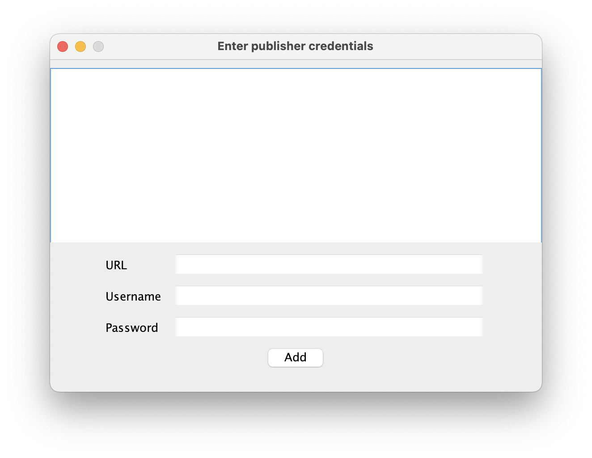
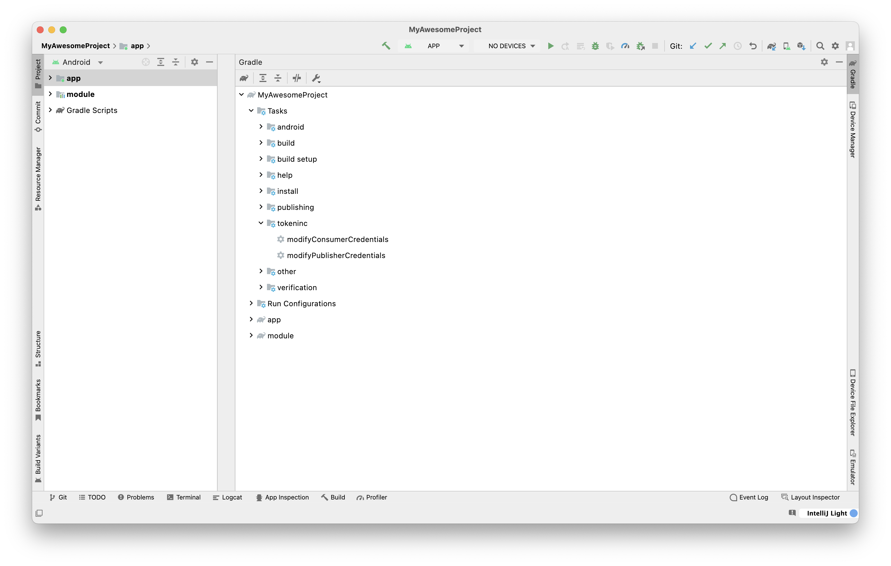

# Tokeninc Gradle Build Tool Plugin

<!-- TOC -->
* [Tokeninc Gradle Build Tool Plugin](#tokeninc-gradle-build-tool-plugin)
    * [What is Tokeninc Gradle Build Tool Plugin](#what-is-tokeninc-gradle-build-tool-plugin)
    * [Release Notes](#release-notes)
      * [Version 0.1 Notes](#version-01-notes)
      * [Version 0.2 Notes](#version-02-notes)
  * [Getting Started](#getting-started)
    * [Using Build Plugin, in Project `build.gradle`](#using-build-plugin-in-project-buildgradle)
      * [Applying Build plugin](#applying-build-plugin)
      * [Java GUI for Build Plugin, Preferred on Android Studio IDE](#java-gui-for-build-plugin-preferred-on-android-studio-ide)
      * [Providing Gradle properties for Build Plugin, Preferred on CI/CD](#providing-gradle-properties-for-build-plugin-preferred-on-cicd)
    * [Using Settings Plugin, in `settings.gradle`](#using-settings-plugin-in-settingsgradle)
      * [Applying Settings Plugin](#applying-settings-plugin)
      * [Java GUI for Settings Plugin, Preferred on Android Studio IDE](#java-gui-for-settings-plugin-preferred-on-android-studio-ide)
      * [Providing Gradle properties for Settings Plugin, Preferred on CI/CD](#providing-gradle-properties-for-settings-plugin-preferred-on-cicd)
    * [Using Publisher Plugin, in library `build.gradle`](#using-publisher-plugin-in-library-buildgradle)
      * [Applying Publisher Plugin](#applying-publisher-plugin)
      * [Java GUI for Publisher Plugin, Preferred on Android Studio IDE](#java-gui-for-publisher-plugin-preferred-on-android-studio-ide)
      * [Providing Gradle properties for Publisher Plugin, Preferred on CI/CD](#providing-gradle-properties-for-publisher-plugin-preferred-on-cicd)
    * [Modifying consumer or publisher credentials](#modifying-consumer-or-publisher-credentials)
    * [Known issues](#known-issues)
      * [Java GUI does not appear on first sync](#java-gui-does-not-appear-on-first-sync)
<!-- TOC -->

### What is Tokeninc Gradle Build Tool Plugin

This plugin allows you to configure your Android projects to consume/publish artifacts
from/to private repositories.

These credentials are either asked by the plugin in a Java GUI or
supplied to the plugin by adding properties while building with Gradle.

The provided credentials are then later saved under the $HOME/.gradle/tokeninc folder
where all other projects that use this plugin can easily read from, i.e. this procedure only has to be done once.

### Release Notes

#### Version 0.1 Notes

    - Added maven consumer and publisher plugins for Android Projects

#### Version 0.2 Notes
    - Added remove all credentials button
    - Added multiple and release repository publishing

## Getting Started

### Using Build Plugin, in Project `build.gradle`

If the repository dependencies are managed in *project level* `build.gradle` file, enable the build plugin as follows:

#### Applying Build plugin 
Using the [plugins DSL](https://docs.gradle.org/current/userguide/plugins.html#sec:plugins_block), in newer versions of gradle

**Project Level `build.gradle`**
```groovy
plugins {
  id "com.tokeninc.tools.build" version "0.2"
}
```
Using [legacy plugin application](https://docs.gradle.org/current/userguide/plugins.html#sec:old_plugin_application), in older versions of gradle

**Project Level `build.gradle`**
```groovy
buildscript {
  repositories {
    gradlePluginPortal()
  }
  dependencies {
    classpath "com.tokeninc.tools:tokeninc-gradle-plugin:0.2"
  }
}

apply plugin: "com.tokeninc.tools.build"
```

#### Java GUI for Build Plugin, Preferred on Android Studio IDE
On first sync, you will be prompted a window to enter repository consumer credentials:


Upon filling the provided fields, the plugin verifies the credentials and saves them under $HOME/.gradle/tokeninc/consume folder


#### Providing Gradle properties for Build Plugin, Preferred on CI/CD

You need to provide the following 3 properties to consume from a Maven Repository

1) consume-repo-url-1
2) consume-repo-usr-1
3) consume-repo-pwd-1

If you need to add multiple repositories, just increment the trailing number to add the next repository
e.g.: consume-repo-url-2, consume-repo-usr-2, consume-repo-pwd-2

Example

`gradle :app:assembleDebug -Pconsume-repo-url-1="https://link/to/maven/repository" -Pconsume-repo-usr-1="your_usr_1" -Pconsume-repo-pwd-1="your_pwd_1"`

### Using Settings Plugin, in `settings.gradle`

If the repository dependencies are managed in the `settings.gradle` file, enable the settings plugin as follows:

#### Applying Settings Plugin
Using the [plugins DSL](https://docs.gradle.org/current/userguide/plugins.html#sec:plugins_block), in newer versions of gradle

**Project Level `settings.gradle`**
```groovy
plugins {
  id "com.tokeninc.tools.settings" version "0.2"
}

dependencyResolutionManagement {
  repositoriesMode.set(RepositoriesMode.FAIL_ON_PROJECT_REPOS)
  repositories {
    // ..
  }
}
```

**Warning**

Due to the restrictions of *plugins* block, 
you need to remove the version information from the *plugins* block in the project level `build.gradle` if you also use the settings plugin

#### Java GUI for Settings Plugin, Preferred on Android Studio IDE
On first sync, you will be prompted a window to enter repository consumer credentials:


Upon filling the provided fields, the plugin verifies the credentials and saves them under $HOME/.gradle/tokeninc/consume folder

#### Providing Gradle properties for Settings Plugin, Preferred on CI/CD

You need to provide the following 3 properties to consume from a Maven Repository

1) consume-repo-url-1
2) consume-repo-usr-1
3) consume-repo-pwd-1

If you need to add multiple repositories, just increment the trailing number to add the next repository
e.g.: consume-repo-url-2, consume-repo-usr-2, consume-repo-pwd-2

Example

`gradle :app:assembleDebug -Pconsume-repo-url-1="https://link/to/maven/repository" -Pconsume-repo-usr-1="your_usr_1" -Pconsume-repo-pwd-1="your_pwd_1"`

### Using Publisher Plugin, in library `build.gradle`

If you would like publish your Android library to a snapshot maven repository, enable the publisher plugin as follows:

You must define the coordinates of your Maven Artifact, `groupId:artifactId:version`, where
1) `groupId` must be explicitly set with `setGroup` method of the module level `build.gradle`
2) `artifactId` already defined implicitly, it is the name of the module/project to be published
3) `version` must be explicitly set with `setVersion` method of the module level `build.gradle`

#### Applying Publisher Plugin
Using the [plugins DSL](https://docs.gradle.org/current/userguide/plugins.html#sec:plugins_block), in newer versions of gradle

**In module level `build.gradle`**
```groovy
plugins {
    id 'com.android.library'
    // ...
    id 'com.tokeninc.tools.publish' version '0.2'
}

group "com.my-organization" // groupId of the package
version "0.0.1" // version of the package
```
When used in a module called 'my-library', the resulting Maven Coordinates will be `"com.my-organization:my-library:0.0.1"`

Using [legacy plugin application](https://docs.gradle.org/current/userguide/plugins.html#sec:old_plugin_application), in older versions of gradle

**In project level `build.gradle`**
```groovy
buildscript {
  repositories {
    gradlePluginPortal()
  }
  dependencies {
    classpath "com.tokeninc.tools:tokeninc-gradle-plugin:0.2"
  }
}
```
**In module level `build.gradle`**
```groovy
apply plugin: 'com.android.library'
// ...
apply plugin: 'com.tokeninc.tools.publish'

group "com.my-organization" // groupId of the package
version "0.0.1" // version of the package
```
When used in a module called 'my-library', the resulting Maven Coordinates will be `"com.my-organization:my-library:0.0.1"`
#### Java GUI for Publisher Plugin, Preferred on Android Studio IDE
On first sync, you will be prompted a window to enter snapshot repository publisher credentials:



Upon filling the provided fields, the plugin verifies the credentials and saves them under $HOME/.gradle/tokeninc/publish folder

To publish your library to a snapshot repository, you can click on `publishSnapshotPublicationWithTokenPlugin` task in `tokeninc` tasks under your library module's Gradle tasks.

Please note that publish credentials set through the Java GUI should be for a snapshot repository, as the existence of graphics environment hints a developer build, hence a snapshot artifact

Use the next method if you need to publish to one or multiple release repositories

#### Providing Gradle properties for Publisher Plugin, Preferred on CI/CD

You need to provide the following 3 properties at least to publish to a Maven Repository

1) publish-repo-url-1
2) publish-repo-usr-1
3) publish-repo-pwd-1

If you need to add multiple repositories, just increment the trailing number to add the next repository
e.g.: publish-repo-url-2, publish-repo-usr-2, publish-repo-pwd-2

Example

`gradle :my-library:publishReleasePublicationWithTokenPlugin -Ppublish-repo-url-1="https://link/to/release/1/maven/repository" -Ppublish-repo-usr-1="your_usr_1" -Ppublish-repo-pwd-1="your_pwd_1"`

### Modifying consumer or publisher credentials

If you need to later add credentials, you can do it so by in Android Studio as follows:

1. Click on *gradle* from the sidebar menu
2. Under the root project, click on *Tasks*
3. Under *Tasks*, click on *tokeninc*

You can click on *modifyConsumerCredentials* or *modifyPublisherCredentials* 
task to modify the corresponding credentials



### Known issues

#### Java GUI does not appear on first sync

When you apply and sync the project for the first time, you may not see a Java GUI popping up.

You might instead come across a warning message from the plugin that says: "Cannot instantiate credentials panel, current graphics environment does not support it!"

This is because the previous gradle daemon instance was started in a headless environment, and it must be stopped. 

Start a terminal on the root directory of the project (e.g. by clicking the tab called `Terminal` located in the bottom left of Android Studio IDE)

and stop the running gradle daemon(s):

`./gradlew --stop`

**Please reach support@tokeninc.com if you have further questions.**
